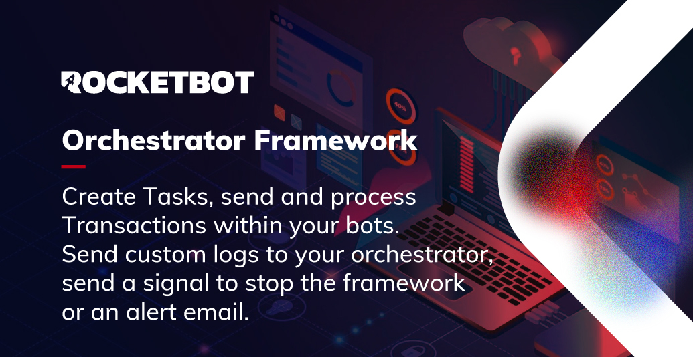

# Orchestrator Framework
  
Manages NOC processes, tasks, transactions, and Assets, and also sends alerts, writes logs, and controls framework shutdown.  

*Read this in other languages: [English](Manual_Orchestrator_Framework.md), [Português](Manual_Orchestrator_Framework.pr.md), [Español](Manual_Orchestrator_Framework.es.md)*
  

## How to install this module
  
To install the module in Rocketbot Studio, it can be done in two ways:
1. Manual: __Download__ the .zip file and unzip it in the modules folder. The folder name must be the same as the module and inside it must have the following files and folders: \__init__.py, package.json, docs, example and libs. If you have the application open, refresh your browser to be able to use the new module.
2. Automatic: When entering Rocketbot Studio on the right margin you will find the **Addons** section, select **Install Mods**, search for the desired module and press install.  

## Description of the commands

### Login NOC
  
Authenticates with NOC and opens a session required by all other commands in this module. Supports API Key, e-mail and password, or a noc.ini file.
|Parameters|Description|example|
| --- | --- | --- |
|URL Server|Base URL of the NOC server. Required unless it is defined in the noc.ini file.|https://roc.myrb.io/|
||||
|Ignore SSL|Disables SSL certificate validation during authentication and Asset requests.||
|Set to var|Variable that receives True when the connection succeeds and False when it fails.|var|

### Get Processes
  
Get all processes
|Parameters|Description|example|
| --- | --- | --- |
|Assign result to a Variable|Variable to store result|Variable|

### Get Tasks
  
Get task
|Parameters|Description|example|
| --- | --- | --- |
|Process Token|Variable where the token of the process to be checked if it should stop or not must be entered|LGPS8DYPJCAVECEF|
|Assign result to a Variable|Variable to store result|Variable|

### Create Task
  
Adds a new task
|Parameters|Description|example|
| --- | --- | --- |
|Process Token|Variable where the token of the process to be checked if it should stop or not must be entered|LGPS8DYPJCAVECEF|
|Task Key|Variable to store new Task key, without {}|key|
|Assign result to a Variable|Variable to store result|Variable|

### Set Priority
  
Set the priority of a task
|Parameters|Description|example|
| --- | --- | --- |
|Process Token|Variable where the token of the process to be checked if it should stop or not must be entered|LGPS8DYPJCAVECEF|
|Task Key|Task Key||
|Priority|Priority for the task||
|Assign result to a Variable|Variable to store result|Variable|

### Add Transaction
  
Add one new transaction
|Parameters|Description|example|
| --- | --- | --- |
|Process Token|Variable where the token of the process to be checked if it should stop or not must be entered|LGPS8DYPJCAVECEF|
|Task Key|Task Key||
|Transaction|Transaction to send. The input must be a list of lists, being the headers the first value of the main list.|[['Header1', 'Header2', 'Header3'],[1, 2, 3]]|
|Has Headers|If checked, it will take the first list as the transaction title.|True|
|Assign result to a Variable|Variable to store result|Variable|

### Add multiple Transactions
  
Add new transactions
|Parameters|Description|example|
| --- | --- | --- |
|Process Token|Variable where the token of the process to be checked if it should stop or not must be entered|LGPS8DYPJCAVECEF|
|Task Key|Task Key||
|Transactions|Transactions to send. The input must be a list of lists, being the headers the first value of the main list.|[['Header1', 'Header2', 'Header3'],[1, 2, 3],[4, 5, 6],[7, 8, 9]]|
|Has Headers|If checked, it will take the first list as the transactions titles.|True|
|Assign result to a Variable|Variable to store result|Variable|

### Get unprocessed transactions
  
Get every unprocessed transactions from a task
|Parameters|Description|example|
| --- | --- | --- |
|Process Token|Variable where the token of the process to be checked if it should stop or not must be entered|LGPS8DYPJCAVECEF|
|Task Key|Task Key||
|Assign result to a Variable|Variable to store result|Variable|

### Set status
  
Change the status of a transaction
|Parameters|Description|example|
| --- | --- | --- |
|Process Token|Variable where the token of the process to be checked if it should stop or not must be entered|LGPS8DYPJCAVECEF|
|Task Key|Task Key||
|Transaction ID|Transaction ID||
|Status|Select the status of the transaction||
|Assign result to a Variable|Variable to store result|Variable|

### Send alert
  
Send an alert message to the emails set into the Orchestrator Process
|Parameters|Description|example|
| --- | --- | --- |
|Process Token|Variable where the token of the process to be checked if it should stop or not must be entered|LGPS8DYPJCAVECEF|
|Assign result to a Variable|Variable to store result|Variable|
|Message|Message to be sent to the email defined in the process alert||

### Send custom log
  
Send custom log
|Parameters|Description|example|
| --- | --- | --- |
|Process instance|Variable where the process instance must be entered|a2f64d5d9988c|
|Process Token|Variable where the token of the process to be checked if it should stop or not must be entered|LGPS8DYPJCAVECEF|
|Message|Message to be sent to the email defined in the process alert||
|Type|Select the type of log to send.|info|

### Stop Framework
  
Sends NOC a stop request for a specific process instance. This command sets the stop state; it must not be confused with Should Stop Framework?, which only reads that state.
|Parameters|Description|example|
| --- | --- | --- |
|Process instance|Key of the process instance that must stop.|a2f64d5d9988c|
|Process Token|Token of the process whose instance will receive the stop request.|LGPS8DYPJCAVECEF|
|Assign result to a Variable|Variable that receives True when NOC registers the request successfully and False when it fails.|Variable|

### Should Stop Framework?
  
Checks NOC for a pending stop request on a process instance. It does not change the state: it returns True when the instance must stop and False when it may continue.
|Parameters|Description|example|
| --- | --- | --- |
|Process instance|Key of the instance whose stop state will be checked.|a2f64d5d9988c|
|Process Token|Token of the process that owns the instance.|LGPS8DYPJCAVECEF|
|Assign result to a Variable|Boolean variable True means the Framework must stop; False means it may continue.|Variable|

### Get a Specific Asset
  
Gets an Asset by name. Only resolves assets with global scope (All); assets tied to a specific process return no data — use Get All Assets in that case. Returns the value, or a full dictionary with extra data enabled.
|Parameters|Description|example|
| --- | --- | --- |
|Asset Name|Exact name of the Asset to retrieve.|Test|
|Process token|Token of the process that owns the Asset. Leave empty for a global Asset.|27FEXKIXFRFDUNVD|
|Instance Key|Key of the instance that owns the Asset. Requires a process token; when login uses noc.ini and this is empty, the key from that file is used.|6241c3a1dd96f8f92f|
|Obtain extra data|When selected, returns all Asset metadata; otherwise returns only its value.|True|
|Assign result to Variable|Variable that stores the Asset value or metadata dictionary, depending on the selected option.|Variable|

### Get All Assets
  
Gets every Asset available to the authenticated user. Basic mode returns name and value and creates one Rocketbot variable per Asset; extra-data mode returns a list of complete metadata.
|Parameters|Description|example|
| --- | --- | --- |
|Assign result to Variable|Variable that stores the resulting list.|Variable|
|Obtain extra data|When selected, each item includes ID, type, value, process token, instance key, and users. Otherwise it returns name/value and also creates variables named after each Asset.|True|

### Add Asset
  
Creates a text, password, or encrypted Asset. Its scope is global without a process, process-level with only a token, or instance-level when an instance key is also supplied. It may optionally be associated with NOC users.
|Parameters|Description|example|
| --- | --- | --- |
|Asset Name|Name of the new Asset. It must follow the uniqueness rules configured in NOC.|NewAsset|
|Process token|Token of the process that will own the Asset. When empty, a global Asset is created.|27FEXKIXFRFDUNVD|
|Instance Key|Key of the instance that will own the Asset. Valid only when a process token is also supplied.|6241c3a1dd96f8f92f|
|User mails|List of NOC user e-mail addresses that will have access to the Asset.|[UserMail1, UserMail2, ...]|
|Asset type|Asset storage type text for general text, password for passwords, or encrypted for encrypted content.|General|
|Asset Value|Value to store in the Asset.|A value|
|Assign result to Variable|Variable that stores the complete response returned by the NOC API.|Variable|

### Modify Asset
  
Updates an existing Asset by ID. The command sends the complete final Asset state: name, type, value, scope, and users. Leaving process and instance empty changes its scope to global.
|Parameters|Description|example|
| --- | --- | --- |
|Asset Id|ID of the Asset to update. It can be obtained from Get a Specific Asset with extra data enabled.|Id_Asset|
|New Asset Name|Final name of the Asset after the update.|NewAsset|
|New process token|Final owner process token. Leave it empty together with the instance to make the Asset global.|27FEXKIXFRFDUNVD|
|New instance Key|Final owner instance key. Requires the process token.|6241c3a1dd96f8f92f|
|New User Mails|Final list of associated user e-mail addresses. Replaces the previous association.|[UserMail1, UserMail2, ...]|
|New Asset type|Final Asset type text, password, or encrypted.|General|
|New Asset Value|Final value to store in the Asset.|A value|
|Assign result to Variable|Variable that stores the complete response returned by the NOC API.|Variable|
